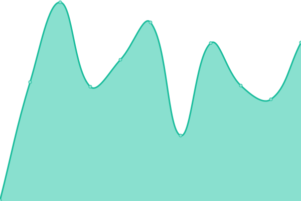
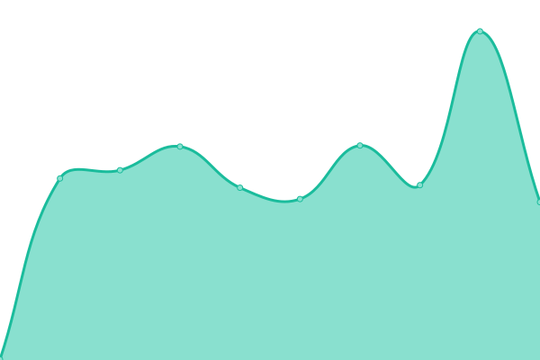
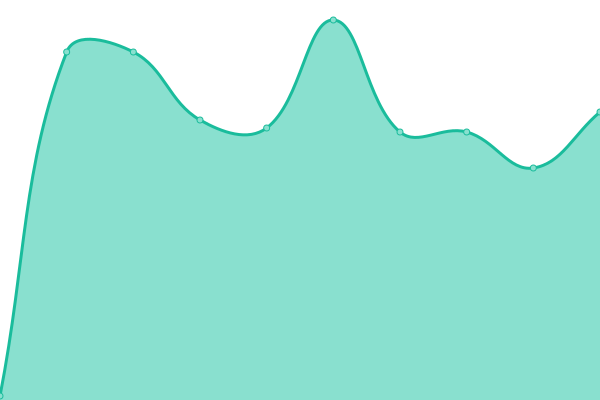
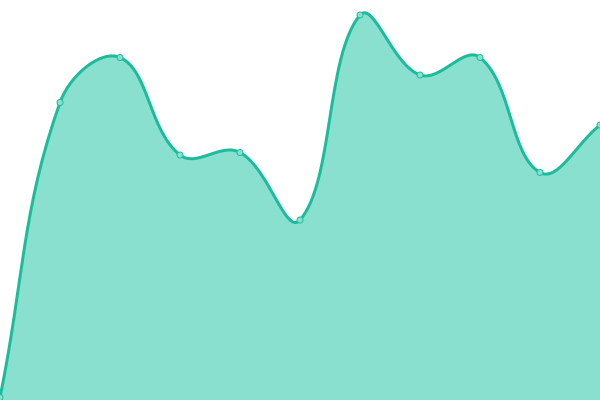
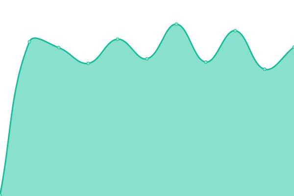

# [📈 Live Status](https://status.oswaldlabs.com): <!--live status--> **🟩 All systems operational**

This repository contains the open-source uptime monitor and status page for [Oswald Labs](https://oswaldlabs.com), powered by [Upptime](https://github.com/upptime/upptime).

With [Upptime](https://upptime.js.org), you can get your own unlimited and free uptime monitor and status page, powered entirely by a GitHub repository. We use [Issues](https://github.com/OswaldLabsOpenSource/status/issues) as incident reports, [Actions](https://github.com/OswaldLabsOpenSource/status/actions) as uptime monitors, and [Pages](https://status.oswaldlabs.com) for the status page.

<!--start: status pages-->
<!-- This summary is generated by Upptime (https://github.com/upptime/upptime) -->
<!-- Do not edit this manually, your changes will be overwritten -->

| URL                                                                         | Status | History                                                                                                            | Response Time                                                                         | Uptime                                                                                                                                                                                                                                   |
| --------------------------------------------------------------------------- | ------ | ------------------------------------------------------------------------------------------------------------------ | ------------------------------------------------------------------------------------- | ---------------------------------------------------------------------------------------------------------------------------------------------------------------------------------------------------------------------------------------- |
| [Oswald Labs](https://oswaldlabs.com)                                       | 🟩 Up  | [oswald-labs.yml](https://github.com/OswaldLabsOpenSource/status/commits/master/history/oswald-labs.yml)           |  244ms      |            |
| [Oswald Labs Blog](https://blog.oswald.foundation)                          | 🟩 Up  | [oswald-labs-blog.yml](https://github.com/OswaldLabsOpenSource/status/commits/master/history/oswald-labs-blog.yml) |  394ms |  |
| [A11Y.co](https://a11y.co)                                                  | 🟩 Up  | [a11-y-co.yml](https://github.com/OswaldLabsOpenSource/status/commits/master/history/a11-y-co.yml)                 |  64ms          |                  |
| [Agastya admin](https://admin.oswaldlabs.com)                               | 🟩 Up  | [agastya-admin.yml](https://github.com/OswaldLabsOpenSource/status/commits/master/history/agastya-admin.yml)       |  97ms     |        |
| [Agastya meta](https://agastya-version.oswaldlabs.com/meta.production.json) | 🟩 Up  | [agastya-meta.yml](https://github.com/OswaldLabsOpenSource/status/commits/master/history/agastya-meta.yml)         |  203ms     |          |
| [Agastya meta](https://agastya-version.oswaldlabs.com/meta.production.json) | 🟩 Up  | [agastya-meta.yml](https://github.com/OswaldLabsOpenSource/status/commits/master/history/agastya-meta.yml)         |  203ms     |          |

<!--end: status pages-->

[**Visit our status website →**](https://status.oswaldlabs.com)

## 📄 License

- Code: [MIT](./LICENSE) © [Oswald Labs](https://oswaldlabs.com)
- Data in the `./history` directory: [Open Database License](https://opendatacommons.org/licenses/odbl/1-0/)
