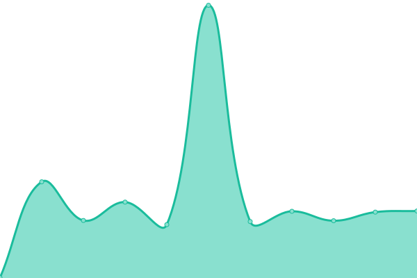

# [📈 Live Status](https://status.oswaldlabs.com): <!--live status--> **🟩 All systems operational**

This repository contains the open-source uptime monitor and status page for [Oswald Labs](https://oswaldlabs.com), powered by [Upptime](https://github.com/upptime/upptime).

With [Upptime](https://upptime.js.org), you can get your own unlimited and free uptime monitor and status page, powered entirely by a GitHub repository. We use [Issues](https://github.com/OswaldLabsOpenSource/status/issues) as incident reports, [Actions](https://github.com/OswaldLabsOpenSource/status/actions) as uptime monitors, and [Pages](https://status.oswaldlabs.com) for the status page.

<!--start: status pages-->
<!-- This summary is generated by Upptime (https://github.com/upptime/upptime) -->
<!-- Do not edit this manually, your changes will be overwritten -->
<!-- prettier-ignore -->
| URL | Status | History | Response Time | Uptime |
| --- | ------ | ------- | ------------- | ------ |
| [Oswald Labs](https://oswaldlabs.com) | 🟩 Up | [oswald-labs.yml](https://github.com/OswaldLabsOpenSource/status/commits/master/history/oswald-labs.yml) | 

 273ms
     
 | 

   

| [Oswald Labs Blog](https://blog.oswald.foundation) | 🟩 Up | [oswald-labs-blog.yml](https://github.com/OswaldLabsOpenSource/status/commits/master/history/oswald-labs-blog.yml) | 

 442ms
     
 | 

   

| [A11Y.co](https://a11y.co) | 🟩 Up | [a11-y-co.yml](https://github.com/OswaldLabsOpenSource/status/commits/master/history/a11-y-co.yml) | 

 73ms
     
 | 

   

| [Agastya admin](https://admin.oswaldlabs.com) | 🟩 Up | [agastya-admin.yml](https://github.com/OswaldLabsOpenSource/status/commits/master/history/agastya-admin.yml) | 

 134ms
     
 | 

   

| [Agastya meta](https://agastya-version.oswaldlabs.com/meta.production.json) | 🟩 Up | [agastya-meta.yml](https://github.com/OswaldLabsOpenSource/status/commits/master/history/agastya-meta.yml) | 

 223ms
     
 | 

   

| [Agastya meta](https://agastya-version.oswaldlabs.com/meta.production.json) | 🟩 Up | [agastya-meta.yml](https://github.com/OswaldLabsOpenSource/status/commits/master/history/agastya-meta.yml) | 

 223ms
     
 | 

   

<!--end: status pages-->

[**Visit our status website →**](https://status.oswaldlabs.com)

## 📄 License

- Code: [MIT](./LICENSE) © [Oswald Labs](https://oswaldlabs.com)
- Data in the `./history` directory: [Open Database License](https://opendatacommons.org/licenses/odbl/1-0/)
